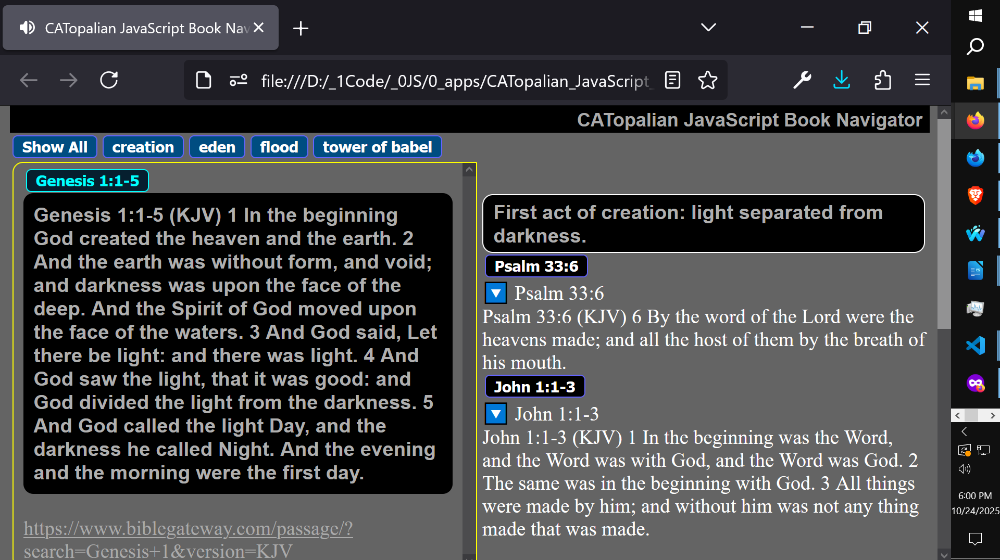

# CATopalian JavaScript Book Navigator
A JavaScript app designed for easy sorting and displaying of data. Easily navigate through any amount of data using category filters buttons.  

---

JavaScript Book Navigator is a powerful new way to explore books, study resources, and educational content right in your browser.
This app automatically generates a clean button menu system based on the categories in your data, allowing you to instantly switch between topics without any hard-coded menus.

Each entry includes detailed information, clickable links, and supporting references — perfect for research, teaching, or deep study sessions.

## Featuring:  
• auto-generated category navigation  
• expandable data system using arrays of objects  
• instant access to structured study notes  
• simple, mobile-friendly interface  
• designed for speed, organization, and clarity  

Whether you're a student, developer, or someone digging deep into historical and literary texts, this tool makes learning faster and smarter.

---

### How to Download this App
1. Click the green Code Button on this github page
2. Choose Download ZIP
3. Save the Zip File
4. Extract All
5. Double click the HTML file to start the App

---

Happy Scripting :-)

//----//

// Dedicated to God the Father  
// All Rights Reserved Christopher Andrew Topalian Copyright 2000-2025  
// https://github.com/ChristopherTopalian  
// https://github.com/ChristopherAndrewTopalian  
// https://sites.google.com/view/CollegeOfScripting  
College of Scripting Music & Science